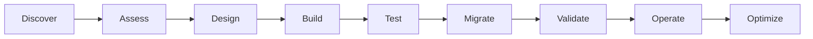

# Cloud Migration Delivery Framework

A delivery-management framework for transitioning legacy applications toward cloud-native or cloud-enabled architectures while coordinating business, engineering, architecture, security, QA, and operations.

This repository contains generic portfolio material only.

## Migration lifecycle

## Major workstreams

- Application discovery and dependency mapping
- Cloud landing-zone readiness
- Architecture and target-state design
- API and integration planning
- Data migration
- Security and compliance
- CI/CD and infrastructure automation
- Functional and non-functional testing
- Cutover and rollback planning
- Hypercare and optimization

## Example migration decision patterns

- Rehost
- Replatform
- Refactor
- Replace
- Retire
- Retain

## Delivery-manager focus

A successful migration requires synchronized planning across technical dependencies, release sequencing, environment readiness, test strategy, security approvals, data reconciliation, cutover ownership, and business continuity.

## Included artifacts

- `checklists/cloud-migration-checklist.md`
- `architecture/target-state-workflow.md`
- `quality/test-automation-strategy.md`
- `integration/api-readiness-checklist.md`
