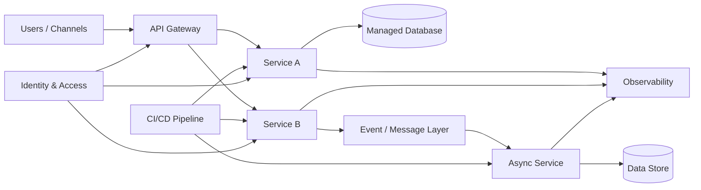

# Target-State Cloud Workflow

## Design checkpoints

- Loose coupling between services
- Stable API contracts
- Centralized identity and authorization
- Automated deployment and rollback
- Observable service health
- Resilience for downstream failures
- Managed secrets and configuration
- Defined RTO/RPO where required
