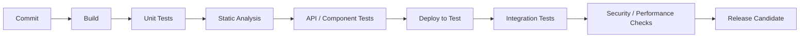

# Test Automation Strategy for Cloud Migration

## Test pyramid

1. Unit tests for service logic
2. Component tests for service boundaries
3. API contract tests
4. Integration tests across dependencies
5. Critical end-to-end user journeys
6. Non-functional testing for performance, resilience, and security

## Automation priorities

Prioritize tests that are:
- repeatable,
- business critical,
- stable,
- high risk,
- frequently executed.

## Pipeline gates

## Migration-specific validation

- Functional parity
- Data completeness and reconciliation
- API behavior equivalence
- Authentication/authorization
- Latency and throughput
- Failover behavior
- Logging and monitoring
- Rollback validation
